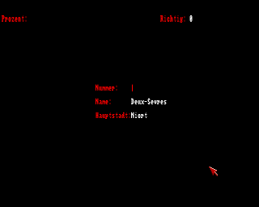

Do you know what the [French départements](https://en.wikipedia.org/wiki/Departments_of_France) are? Apart from their name, they have a capital and they are assigned a number that is used for license plate, postal code, and more.

This *quiz* game is about them and has several game modes:
* *Learn:* Provides a tabular arrangment of the départements. This is very useful in *1996* (when it is hard to come by information in the internet).
* *Trial:* Run a trial exam on *beginner* or *expert* level. On the beginner level, you are presented *two* out of *three* pieces of information - only the third needs to be typed in. On the expert level, you need to deduce everything based on only *one* piece of information.
* *Game:* Corresponds to the trial mode but this time you run against a clock and your success rate is tracked. You start on the beginner level and, if sufficiently successful, are promoted to the expert level and continue there. There is even a *highscore* which is based on the number of correct answers.

The game language is *German* - but you only need to know some key words in order to play it.

# How to Use

Put the repository into a mounted directory of an *emulated* [Amiga 500](https://en.wikipedia.org/wiki/Amiga_500) and run the start script (assuming that AmigaBASIC is installed in mounted `Basic`):
```
execute FranceDeptQuiz
```

You can also start using the workbench (`info`-files provided).

Alternatively, you can open the source file in your [AmigaBASIC](https://en.wikipedia.org/wiki/Amiga_Basic), but be sure to reside in the `src` library.

# Gallery

|  |
| :--: |
| The main menu: Learn, Trial, Game |

|  |
| :--: |
| Learn: List of départements starting from *20* |

|  |
| :--: |
| Trail: Options for the beginner |

|  |
| :--: |
| Beginner is prompted for the number<br>*(the answer is 79)* |

|  |
| :--: |
| Trail: Options for the expert |

|  |
| :--: |
| The highscore featuring the level<br>and the number of correct answers |
